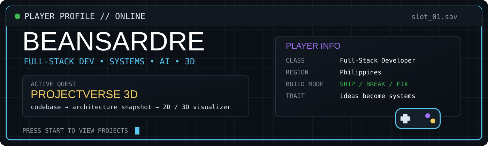

<p align="center">
  
</p>

<p align="center">
  <b>PLAYER:</b> Ardre &nbsp; • &nbsp;
  <b>CLASS:</b> Full-Stack Developer &nbsp; • &nbsp;
  <b>REGION:</b> Philippines
</p>

<p align="center">
  I like backend-heavy apps, weird visual ideas, AI experiments, and projects that somehow grow into full systems.
</p>

---

## 🎯 ACTIVE QUEST — ProjectVerse 3D

<table>
<tr>
<td width="62%" valign="top">

**Objective:** turn JavaScript / TypeScript codebases into visual architecture maps.

```text
SOURCE CODE
   ↓
SCANNER
   ↓
ARCHITECTURE SNAPSHOT
   ↓
POSTGRESQL
   ↓
2D / 3D VISUALIZER
```

`Next.js` `PostgreSQL` `Supabase` `Three.js`

> Current state: private while I finish cleaning it up.

</td>
<td width="38%" valign="top">

### Quest checklist

```text
[✓] real database
[✓] backend logic
[✓] architecture worth showing
[✓] 2D / 3D visual layer
[✓] probably too many moving parts
[ ] finished
```

**Build loop:** ship → break → fix → ship

</td>
</tr>
</table>

---

## 🕹️ PROJECT SELECT

<table>
<tr>
<td width="50%" valign="top">

### [Company Identity Resolution](https://github.com/BeansDed/High-Scale-Company-Identity-Resolution-Engine)

**Backend / matching engine**

Matches messy company records using blocking, weighted matching, confidence scoring, and golden-record merging.

`TypeScript` `Docker` `Redis` `Prometheus`

<sub>Real-world ugly data problems are more interesting than another CRUD demo.</sub>

</td>
<td width="50%" valign="top">

### [LUMINA_SORT](https://github.com/BeansDed/LUMINA_SORT)

**Image processing / glitch engine**

Deterministic pixel sorting with actual image data. No generative image model — just algorithms doing strange things to pixels.

`Python` `Django` `NumPy` `PostgreSQL`

<sub>Probably the most visually weird thing I've built.</sub>

</td>
</tr>
<tr>
<td width="50%" valign="top">

### [SkillForge](https://github.com/BeansDed/SkillForge)

**Full-stack product**

Gamified learning with progression, auth, server actions, persistent state, and a real database behind it.

`Next.js` `TypeScript` `Prisma` `PostgreSQL`

<sub>Game mechanics make normal product logic way more fun.</sub>

</td>
<td width="50%" valign="top">

### [TitanAlpha](https://github.com/BeansDed/TitanAlpha)

**Distributed systems experiment**

Event-driven market-intelligence work around ingestion, signal processing, and distributed services.

`Go` `Rust` `Temporal` `Redpanda` `ClickHouse`

<sub>This one escalated way past the original idea.</sub>

</td>
</tr>
</table>

<details>
<summary><b>🎒 Open side quests</b></summary>

<br/>

**[Portfolio](https://github.com/BeansDed/Porfortlio)** — project case studies and the polished side of my work.  
`Next.js` `TypeScript` `GitHub Pages`

**[Irminsul / Hoyoverse Lore](https://github.com/BeansDed/Hoyoverse-Lore)** — lore search across a giant connected game universe.  
`TypeScript` `AI / retrieval experiments`

</details>

---

## 📊 PLAYER STATS

<p align="center">
  
  
</p>

<p align="center">
  
</p>

---

## 🧰 INVENTORY / LOADOUT

<p align="center">
  
</p>

<table>
<tr>
<td width="33%" valign="top">

### Core
`TypeScript`  
`JavaScript`  
`Python`  
`PostgreSQL`

</td>
<td width="34%" valign="top">

### Web / backend
`Next.js`  
`React`  
`Node.js`  
`Django`  
`Supabase`

</td>
<td width="33%" valign="top">

### Experimental
`Docker`  
`Three.js`  
`Go`  
`Rust`  
`GitHub Actions`

</td>
</tr>
</table>

---

## 🏆 ACHIEVEMENTS UNLOCKED

- built a deterministic image-processing engine instead of wrapping an AI image API
- built a company identity-matching system around messy real-world-style data
- built gamified product logic with persistent progression
- experimented with distributed systems because apparently one service was not enough
- learned that **“what if I add 3D?”** is a dangerous question

---

## 💾 DEV SAVE FILE

```text
PLAYER        Ardre
CURRENT QUEST ProjectVerse 3D
PLAYSTYLE     backend-heavy / visual experiments / systems
STATUS        probably refactoring something that already worked
TRAIT         simple ideas become systems
```

<p align="center">
  <b>BUILD. BREAK. DEBUG. RESPAWN.</b>
</p>