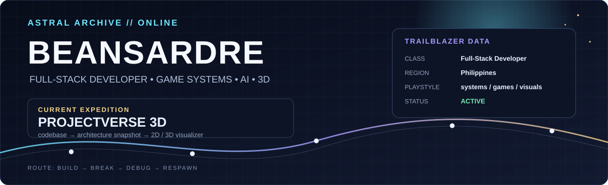
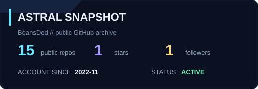
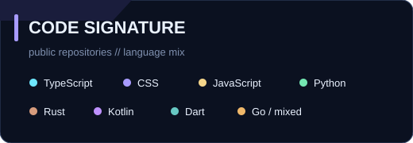
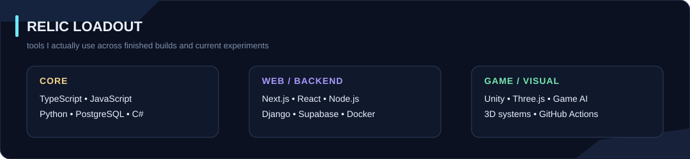
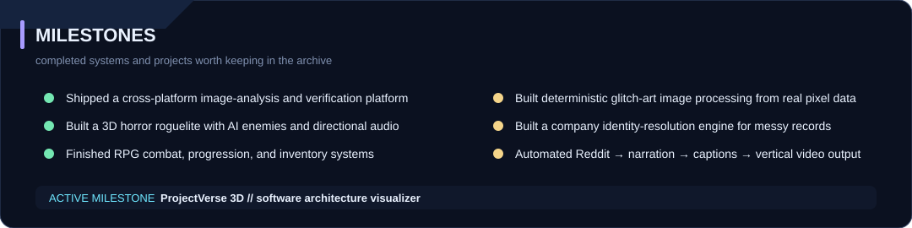
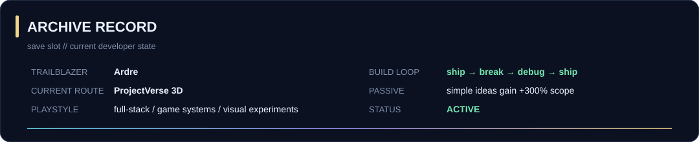

  

  <b>ARDRE</b> &nbsp; • &nbsp; Full-Stack Developer &nbsp; • &nbsp; Game Systems &nbsp; • &nbsp; AI / 3D

  Original sci-fi RPG / astral archive theme — clean enough to read, game-like enough to feel like mine.

---

## ✦ CURRENT FOCUS

  Building full-stack systems, game-flavored interfaces, automation tools, and AI experiments while sharpening backend architecture, databases, and deployment.

---

## ✦ MISSION ARCHIVE

### Featured public work

**[Arcane Conquest Website](https://github.com/BeansDed/ArcaneConquestWebsite)** — fantasy RPG-style web experience with custom UI, character interactions, maps, and game-themed presentation.  
`HTML` `CSS` `JavaScript`

**[LUMINA_SORT](https://github.com/BeansDed/LUMINA_SORT)** — algorithmic image-processing engine that uses sorting algorithms to create glitch-style visuals without generative AI.  
`Python` `Django` `NumPy`

**[High-Scale Company Identity Resolution Engine](https://github.com/BeansDed/High-Scale-Company-Identity-Resolution-Engine)** — TypeScript project exploring company identity matching and resolution at scale.  
`TypeScript`

**[SkillForge](https://github.com/BeansDed/SkillForge)** — gamified learning platform with authentication, progression, server actions, and PostgreSQL-backed data.  
`Next.js` `TypeScript` `Prisma` `PostgreSQL`

**[Irminsul / Hoyoverse Lore](https://github.com/BeansDed/Hoyoverse-Lore)** — AI/retrieval experiment for exploring large connected game-lore universes.  
`TypeScript` `AI / Retrieval`

**[PetPal](https://github.com/BeansDed/PetPal)** — cross-platform pet-care project for reminders, records, and activity tracking.  
`Kotlin`

<b>✦ MORE WORK</b>

 

**[Portfolio](https://github.com/BeansDed/Porfortlio)** — personal portfolio and project case studies.  
`Web` `Frontend` `Project Showcase`

**[Weather App](https://github.com/BeansDed/Weather-app)** — minimal weather dashboard with city search and forecast features.  
`JavaScript`

---

## ✦ DATA BANK

  
  

  Generated inside this repository and refreshed by GitHub Actions.

---

## ✦ RELIC LOADOUT

  

---

## ✦ MILESTONES

  

---

## ✦ ARCHIVE RECORD

  

  <b>BUILD // BREAK // DEBUG // RESPAWN</b>

