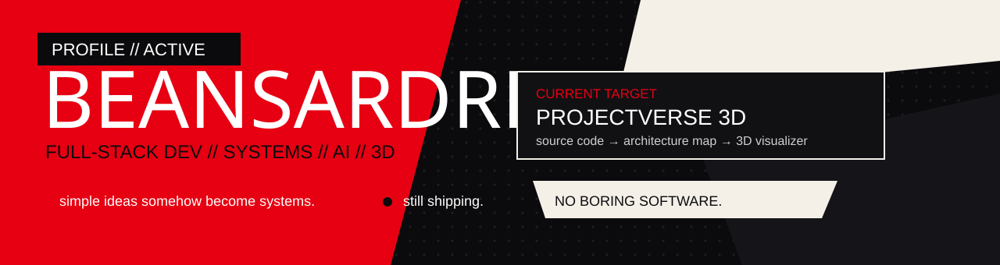

<p align="center">
  
</p>

<p align="center">
  <b>Ardre</b> · IT student · full-stack developer · Philippines
</p>

<p align="center">
  I like backend-heavy apps, weird visual ideas, AI experiments, and projects that accidentally become systems.
</p>

---

## 01 / CURRENT TARGET

<table>
<tr>
<td width="58%" valign="top">

### ProjectVerse 3D

Turning JavaScript / TypeScript projects into visual architecture maps.

```text
SOURCE CODE
    ↓
SCANNER
    ↓
ARCHITECTURE SNAPSHOT
    ↓
POSTGRESQL
    ↓
2D / 3D VISUALIZER
```

`Next.js` `PostgreSQL` `Supabase` `Three.js`

> private while I finish cleaning it up.

</td>
<td width="42%" valign="top">

### Build mode

```text
[✓] real database
[✓] backend logic
[✓] architecture worth showing
[✓] visual layer
[✓] too many moving parts
[ ] finished
```

**Mood:** shipping → breaking → fixing → shipping

**Weakness:** simple ideas somehow become systems.

**Strength:** same thing.

</td>
</tr>
</table>

---

## 02 / SELECTED WORK

<table>
<tr>
<td width="50%" valign="top">

### [Company Identity Resolution](https://github.com/BeansDed/High-Scale-Company-Identity-Resolution-Engine)

**Backend / matching engine**

Matches messy company records using blocking, weighted matching, confidence scoring, and golden-record merging.

`TypeScript` `Docker` `Redis` `Prometheus`

<sub>I like this one because the problem is ugly in a very real-world way.</sub>

</td>
<td width="50%" valign="top">

### [LUMINA_SORT](https://github.com/BeansDed/LUMINA_SORT)

**Image processing / glitch engine**

Deterministic pixel sorting with real image data. No generative image model — just algorithms doing cursed things to pixels.

`Python` `Django` `NumPy` `PostgreSQL`

<sub>Probably the most visually weird thing I've built.</sub>

</td>
</tr>
<tr>
<td width="50%" valign="top">

### [SkillForge](https://github.com/BeansDed/SkillForge)

**Full-stack product**

Gamified learning with progression, auth, server actions, persistent state, and a real database behind it.

`Next.js` `TypeScript` `Prisma` `PostgreSQL`

<sub>Game mechanics make normal CRUD way less boring.</sub>

</td>
<td width="50%" valign="top">

### [TitanAlpha](https://github.com/BeansDed/TitanAlpha)

**Distributed systems experiment**

Event-driven market-intelligence work around ingestion, signal processing, and distributed services.

`Go` `Rust` `Temporal` `Redpanda` `ClickHouse`

<sub>Yes, this is more infrastructure than a normal student project needs.</sub>

</td>
</tr>
</table>

<details>
<summary><b>More experiments</b></summary>

<br/>

**[Portfolio](https://github.com/BeansDed/Porfortlio)** — the polished home for the projects that survive my experiments.  
`Next.js` `TypeScript` `GitHub Pages`

**[Irminsul / Hoyoverse Lore](https://github.com/BeansDed/Hoyoverse-Lore)** — lore search across a giant connected game universe.  
`TypeScript` `AI / retrieval experiments`

</details>

---

## 03 / LIVE DATA

<p align="center">
  
  
</p>

<p align="center">
  
</p>

---

## 04 / LOADOUT

<p align="center">
  
</p>

<table>
<tr>
<td width="33%" valign="top">

**Daily**  
`TypeScript`  
`JavaScript`  
`Python`  
`PostgreSQL`

</td>
<td width="34%" valign="top">

**Web / backend**  
`Next.js`  
`React`  
`Node.js`  
`Django`  
`Supabase`

</td>
<td width="33%" valign="top">

**Chaos tools**  
`Docker`  
`Three.js`  
`Go`  
`Rust`  
`GitHub Actions`

</td>
</tr>
</table>

---

## 05 / HOW I BUILD

```text
01  make it work before making it dramatic
02  real databases > fake demo data
03  don't commit secrets
04  show architecture when it matters
05  measure performance before claiming performance
06  clean code > fake complexity
07  boring UX is a redesign request
08  "what if I add 3D?" is a dangerous thought
```

---

## 06 / LIVE FEED

```text
beans@phantomos:~$ whoami
Ardre // IT student // full-stack dev

beans@phantomos:~$ current_target
ProjectVerse 3D

beans@phantomos:~$ interests
systems / AI / automation / 3D / building stuff for no reason

beans@phantomos:~$ status
[ ACTIVE ] probably refactoring something that already worked
```

<p align="center">
  <b>NO BORING SOFTWARE.</b><br/>
  <sub>take your code back.</sub>
</p>