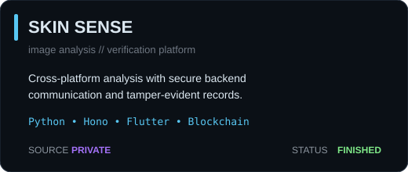
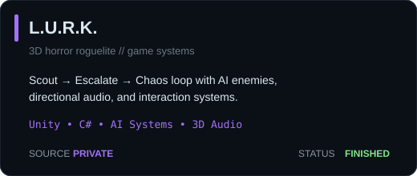
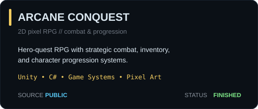
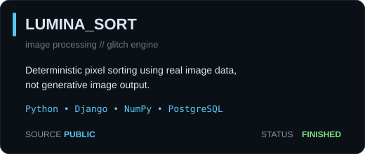
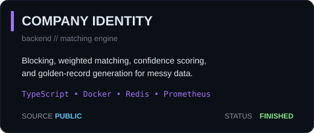
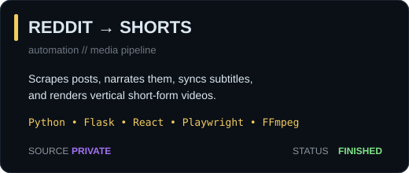

<p align="center">
  
</p>

<p align="center">
  <b>PLAYER:</b> Ardre &nbsp; • &nbsp;
  <b>CLASS:</b> Full-Stack Developer &nbsp; • &nbsp;
  <b>REGION:</b> Philippines
</p>

<p align="center">
  I like backend-heavy apps, weird visual ideas, AI experiments, and projects that somehow grow into full systems.
</p>

---

## 🎯 ACTIVE QUEST — ProjectVerse 3D

<table>
<tr>
<td width="62%" valign="top">

**Objective:** turn JavaScript / TypeScript codebases into visual architecture maps.

```text
SOURCE CODE
   ↓
SCANNER
   ↓
ARCHITECTURE SNAPSHOT
   ↓
POSTGRESQL
   ↓
2D / 3D VISUALIZER
```

`Next.js` `PostgreSQL` `Supabase` `Three.js`

> Current state: private while I finish cleaning it up.

</td>
<td width="38%" valign="top">

### Quest checklist

```text
[✓] real database
[✓] backend logic
[✓] architecture worth showing
[✓] 2D / 3D visual layer
[✓] probably too many moving parts
[ ] finished
```

**Build loop:** ship → break → fix → ship

</td>
</tr>
</table>

---

## 🕹️ PROJECT SELECT — COMPLETED BUILDS

<p align="center">
  
  
</p>

<p align="center">
  <a href="https://github.com/BeansDed/ArcaneConquestWebsite"></a>
  <a href="https://github.com/BeansDed/LUMINA_SORT"></a>
</p>

<p align="center">
  <a href="https://github.com/BeansDed/High-Scale-Company-Identity-Resolution-Engine"></a>
  
</p>

<p align="center">
  <sub>Public cards are clickable. Private-source builds are still shown as finished portfolio projects.</sub>
</p>

<details>
<summary><b>🎒 Open side quests</b></summary>

<br/>

**[Portfolio](https://github.com/BeansDed/Porfortlio)** — project case studies and the polished side of my work.  
`Next.js` `TypeScript` `GitHub Pages`

**[Irminsul / Hoyoverse Lore](https://github.com/BeansDed/Hoyoverse-Lore)** — lore search across a giant connected game universe.  
`TypeScript` `AI / retrieval experiments`

</details>

---

## 📊 PLAYER STATS

<p align="center">
  
  
</p>

<p align="center">
  <sub>Generated inside this repository and refreshed by GitHub Actions — no flaky external stats host.</sub>
</p>

---

## 🧰 INVENTORY / LOADOUT

<p align="center">
  
</p>

<table>
<tr>
<td width="33%" valign="top">

### Core
`TypeScript`  
`JavaScript`  
`Python`  
`PostgreSQL`

</td>
<td width="34%" valign="top">

### Web / backend
`Next.js`  
`React`  
`Node.js`  
`Django`  
`Supabase`

</td>
<td width="33%" valign="top">

### Game / experimental
`Unity`  
`C#`  
`Three.js`  
`Docker`  
`GitHub Actions`

</td>
</tr>
</table>

---

## 🏆 ACHIEVEMENTS UNLOCKED

- shipped a cross-platform image-analysis and verification platform
- built a 3D horror roguelite with AI enemies and directional audio
- finished a 2D RPG with combat, progression, and inventory systems
- built a deterministic image-processing engine instead of wrapping an AI image API
- built a company identity-matching system around messy real-world-style data
- automated a complete Reddit → narrated short-video pipeline

---

## 💾 DEV SAVE FILE

```text
PLAYER        Ardre
CURRENT QUEST ProjectVerse 3D
PLAYSTYLE     full-stack / game systems / visual experiments
STATUS        probably refactoring something that already worked
TRAIT         simple ideas become systems
```

<p align="center">
  <b>BUILD. BREAK. DEBUG. RESPAWN.</b>
</p>