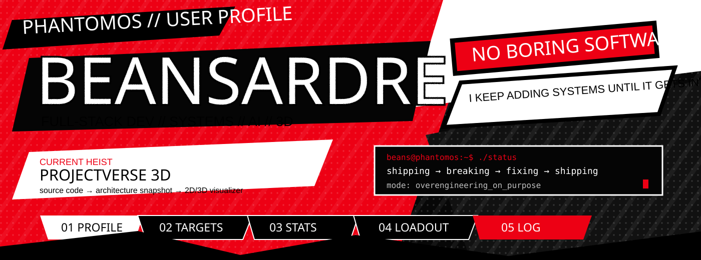
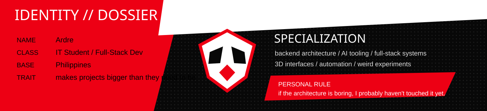

<p align="center">
  
</p>

<p align="center">
  <b>CODENAME:</b> BEANSARDRE &nbsp; // &nbsp;
  <b>CLASS:</b> FULL-STACK DEV &nbsp; // &nbsp;
  <b>BASE:</b> PHILIPPINES &nbsp; // &nbsp;
  <b>STATUS:</b> ACTIVE
</p>

<p align="center">
  <i>I build things, overcomplicate them, break them, then somehow make them cooler.</i>
</p>

<p align="center">
  
</p>

<table>
<tr>
<td width="52%" valign="top">

## CURRENT HEIST // PROJECTVERSE 3D

```text
SOURCE CODE
   ↓
SCANNER
   ↓
ARCHITECTURE SNAPSHOT
   ↓
POSTGRESQL
   ↓
2D / 3D VISUALIZER
```

Turning JavaScript / TypeScript projects into visual architecture maps.

`Next.js` `PostgreSQL` `Supabase` `Three.js`

> private while I finish cleaning it up.

</td>
<td width="48%" valign="top">

## CURRENT BUILD MODE

```text
[✓] real database
[✓] actual backend logic
[✓] architecture worth diagramming
[✓] weird visual layer
[✓] probably too many moving parts
[ ] done
```

**Mood:** shipping → breaking → fixing → shipping

**Weakness:** simple ideas somehow become systems.

**Strength:** same thing.

</td>
</tr>
</table>

<p align="center">
  
</p>

<table>
<tr>
<td width="50%" valign="top">

## 01 // [COMPANY IDENTITY RESOLUTION](https://github.com/BeansDed/High-Scale-Company-Identity-Resolution-Engine)

**BACKEND / MATCHING ENGINE**

Messy company records go in. Blocking, weighted matching, confidence scoring, and golden-record merging happen. Cleaner identities come out.

`TypeScript` `Docker` `Redis` `Prometheus`

> I like this one because the problem is ugly in a very real-world way.

</td>
<td width="50%" valign="top">

## 02 // [LUMINA_SORT](https://github.com/BeansDed/LUMINA_SORT)

**IMAGE PROCESSING / GLITCH ENGINE**

Deterministic pixel sorting with actual image data. No generative image model. Just algorithms doing cursed things to pixels.

`Python` `Django` `NumPy` `PostgreSQL`

> probably the most visually weird thing I've built.

</td>
</tr>
<tr>
<td width="50%" valign="top">

## 03 // [SKILLFORGE](https://github.com/BeansDed/SkillForge)

**FULL-STACK PRODUCT**

Gamified learning with progression, auth, server actions, persistent state, and a real database behind it.

`Next.js` `TypeScript` `Prisma` `PostgreSQL`

> game mechanics make normal CRUD way less boring.

</td>
<td width="50%" valign="top">

## 04 // [TITANALPHA](https://github.com/BeansDed/TitanAlpha)

**DISTRIBUTED SYSTEMS EXPERIMENT**

Event-driven market-intelligence work around ingestion, signal processing, and distributed services.

`Go` `Rust` `Temporal` `Redpanda` `ClickHouse`

> yes, this is more infrastructure than a normal student project needs.

</td>
</tr>
<tr>
<td width="50%" valign="top">

## 05 // [PORTFOLIO](https://github.com/BeansDed/Porfortlio)

**PERSONAL SITE / CASE STUDIES**

The polished home for the projects that survive my experiments.

`Next.js` `TypeScript` `GitHub Pages`

> eventually I need to fix that repo typo. I know.

</td>
<td width="50%" valign="top">

## 06 // [IRMINSUL / HOYOVERSE LORE](https://github.com/BeansDed/Hoyoverse-Lore)

**AI / RETRIEVAL EXPERIMENT**

A lore-search system for asking questions across a giant connected game universe without reading hundreds of separate wiki pages.

`TypeScript` `AI / retrieval experiments`

> giant knowledge spaces are messy. that's the fun part.

</td>
</tr>
</table>

<p align="center">
  
</p>

<p align="center">
  
  
</p>

<p align="center">
  
</p>

<details>
<summary><b>OPEN STATUS REPORT // click me</b></summary>

```text
PUBLIC GITHUB
├─ experiments
├─ school projects
├─ full-stack systems
├─ backend-heavy stuff
├─ things I made because I was bored
└─ projects that got way bigger than the original idea
```

</details>

---

# ARSENAL // LOADOUT

<p align="center">
  
</p>

<table>
<tr>
<td width="33%" valign="top">

### PRIMARY
`TypeScript`  
`JavaScript`  
`Python`  
`PostgreSQL`

</td>
<td width="34%" valign="top">

### WEB / BACKEND
`Next.js`  
`React`  
`Node.js`  
`Django`  
`Supabase`

</td>
<td width="33%" valign="top">

### CHAOS TOOLS
`Docker`  
`Three.js`  
`Go`  
`Rust`  
`GitHub Actions`

</td>
</tr>
</table>

---

# RULES OF ENGAGEMENT

```text
[01] make it work before making it dramatic
[02] real databases > fake demo data
[03] don't commit secrets. ever.
[04] if the system is complicated, draw the architecture
[05] if I claim performance, measure it
[06] clean code > fake complexity
[07] boring UX is a redesign request
[08] "what if I add 3D?" is a dangerous thought
```

---

# LIVE FEED

```text
beans@phantomos:~$ whoami
Ardre // IT student // full-stack dev

beans@phantomos:~$ current_target
ProjectVerse 3D

beans@phantomos:~$ interests
systems / AI / automation / 3D / building stuff for no reason

beans@phantomos:~$ status
[ ACTIVE ] probably refactoring something that already worked
```

<p align="center">
  <b>NO BORING SOFTWARE.</b><br/>
  <sub>take your code back.</sub>
</p>