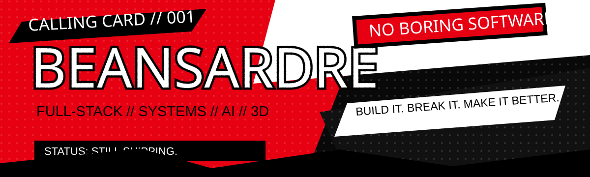

<p align="center">
  
</p>

<table>
<tr>
<td width="64%">

## THE CALLING CARD

I'm **Ardre**. I build full-stack systems, AI tools, and developer stuff that is more fun to use than it probably needs to be.

Most of my work sits somewhere between **backend architecture**, **web apps**, **automation**, and **3D experiments**.

I care more about whether something actually works than how many buzzwords fit in the README.

</td>
<td width="36%">

### CURRENT TARGET

**ProjectVerse 3D**

Turning JavaScript / TypeScript projects into visual architecture maps.

`Next.js` `PostgreSQL` `Supabase` `Three.js`

> private while I finish cleaning it up.

</td>
</tr>
</table>

---

## MOST WANTED

<table>
<tr>
<td width="50%">

### 01 — [Company Identity Resolution Engine](https://github.com/BeansDed/High-Scale-Company-Identity-Resolution-Engine)

A TypeScript service for matching messy company records at scale using blocking, weighted strategies, and golden-record merging.

**TypeScript · Docker · Redis · Prometheus**

</td>
<td width="50%">

### 02 — [LUMINA_SORT](https://github.com/BeansDed/LUMINA_SORT)

An algorithmic image-processing engine that makes glitch art by sorting real pixel data — no generative image model involved.

**Python · Django · NumPy · PostgreSQL**

</td>
</tr>

<tr>
<td width="50%">

### 03 — [SkillForge](https://github.com/BeansDed/SkillForge)

A gamified learning platform with progression, auth, server actions, and a real database behind it.

**Next.js · TypeScript · Prisma · PostgreSQL**

</td>
<td width="50%">

### 04 — [TitanAlpha](https://github.com/BeansDed/TitanAlpha)

An event-driven market-intelligence experiment built around ingestion, signal processing, and distributed services.

**Go · Rust · Temporal · Redpanda · ClickHouse**

</td>
</tr>

<tr>
<td width="50%">

### 05 — [Portfolio](https://github.com/BeansDed/Porfortlio)

My actual portfolio and project case studies.

**Next.js · TypeScript · GitHub Pages**

</td>
<td width="50%">

### 06 — [Irminsul / Hoyoverse Lore](https://github.com/BeansDed/Hoyoverse-Lore)

A lore-search experiment for asking questions across a huge connected game universe without digging through hundreds of wiki pages.

**TypeScript · AI / retrieval experiments**

</td>
</tr>
</table>

---

## ARSENAL

**Daily drivers**  
`TypeScript` · `JavaScript` · `Python` · `PostgreSQL`

**Web / backend**  
`Next.js` · `React` · `Django` · `Node.js` · `Supabase`

**Systems / experiments**  
`Docker` · `Go` · `Rust` · `Three.js` · `GitHub Actions`

---

## HOW I LIKE TO BUILD

- make the feature work before making the README dramatic
- keep secrets out of git
- use real databases, not fake screenshots
- show the architecture when the project gets complicated
- if I say something scales, I should be able to prove it

---

## LOG

```text
> studying IT in the Philippines
> currently building: ProjectVerse 3D
> usually working on: web systems / AI tools / weird side projects
> status: probably refactoring something
```

<p align="center">
  <b>TAKE YOUR CODE BACK.</b>
</p>
