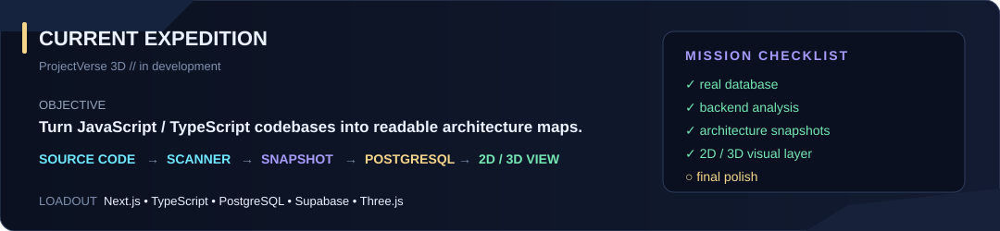
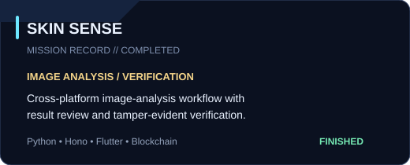
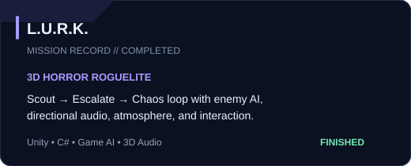
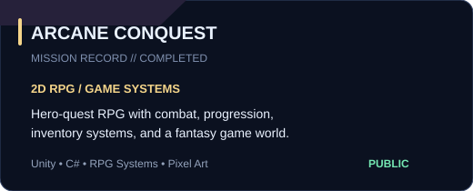
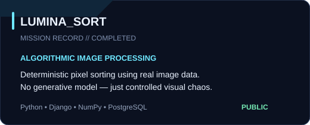
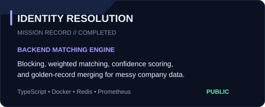
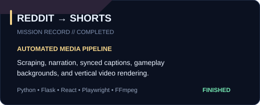

  

  <b>ARDRE</b> &nbsp; • &nbsp; Full-Stack Developer &nbsp; • &nbsp; Game Systems &nbsp; • &nbsp; AI / 3D

  Original sci-fi RPG / astral archive theme — clean enough to read, game-like enough to feel like mine.

---

## ✦ CURRENT EXPEDITION

  

---

## ✦ MISSION ARCHIVE

  
  

  
  

  
  

  Public mission records are clickable. Private-source finished projects stay visible without dead links.

<b>✦ SIDE MISSIONS / MORE WORK</b>

 

**[SkillForge](https://github.com/BeansDed/SkillForge)** — gamified learning platform with auth, progression, server actions, and PostgreSQL.  
`Next.js` `TypeScript` `Prisma` `PostgreSQL`

**[Irminsul / Hoyoverse Lore](https://github.com/BeansDed/Hoyoverse-Lore)** — lore-search / retrieval experiment for large connected game universes.  
`TypeScript` `AI / retrieval`

**[Portfolio](https://github.com/BeansDed/Porfortlio)** — portfolio and project case studies.  
`Next.js` `TypeScript`

---

## ✦ DATA BANK

  
  

  Generated inside this repository and refreshed by GitHub Actions.

---

## ✦ RELIC LOADOUT

  

---

## ✦ MILESTONES

  

---

## ✦ ARCHIVE RECORD

  

  <b>BUILD // BREAK // DEBUG // RESPAWN</b>

